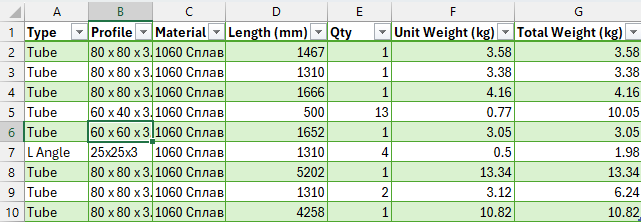
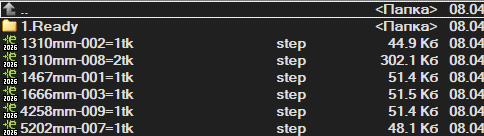

# SolidWorks Macros

## 🇷🇺 Описание
Набор макросов для автоматизации работы в SolidWorks:

- экспорт Cut List в STEP
- формирование структуры файлов
- генерация Excel отчётов
- расчёт веса

---

## 🇬🇧 Description
Collection of SolidWorks automation macros:

- export Cut List to STEP
- automatic file structure generation
- Excel report creation
- weight calculation

---

## 🚀 Current Tool

### Cut List to STEP

## 📸 Screenshots

### Excel Report


### STEP Files


Макрос для:
- экспорта элементов weldment в STEP
- автоматического именования файлов
- создания Excel отчета

---

## 📦 Версия

**v2.2 (STABLE)**

---

## 📁 Структура проекта

```
Cut_List_to_STEP/
├─ src/
│  └─ Cut_List_to_step_v2_2_STABLE.swp
```
---

## 🔄 Changelog

### v2.2 (STABLE)
- исправлен расчет веса
- добавлено округление
- стабильная версия

### v2.0
- добавлен Excel отчет
- добавлена генерация STEP

### v1.0
- базовый экспорт STEP

---

## 🧑‍💻 Автор

Evgeniy (xd5oggy)
